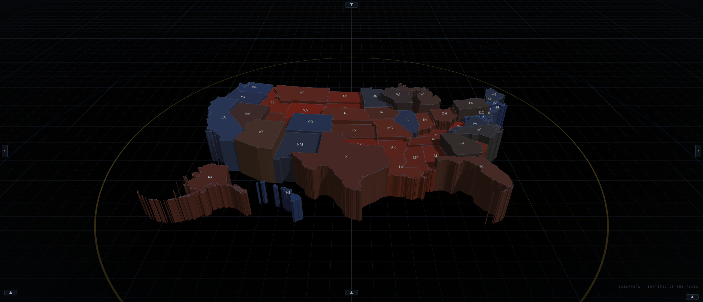
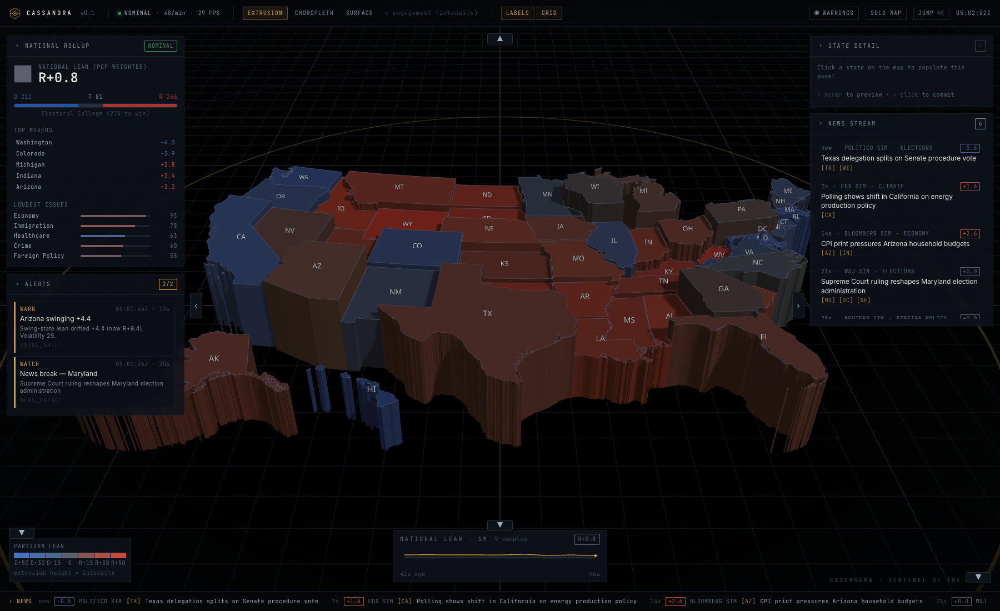
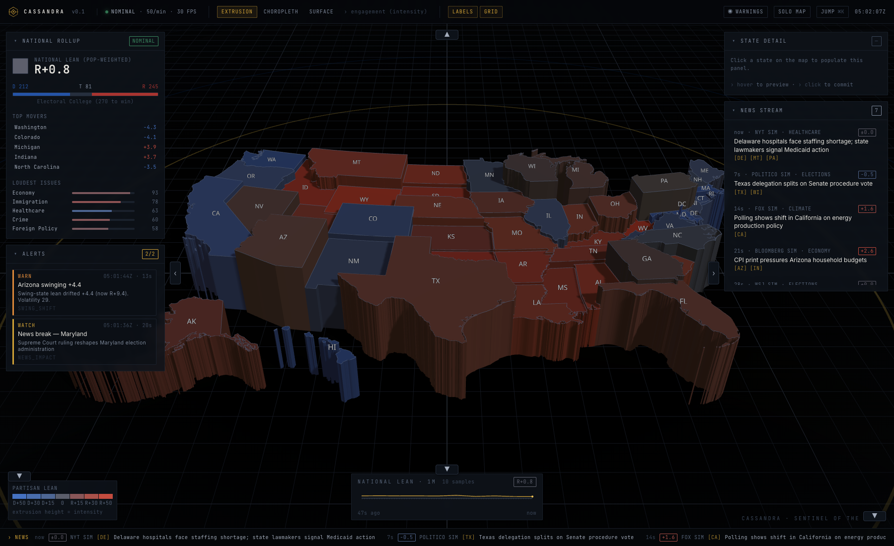
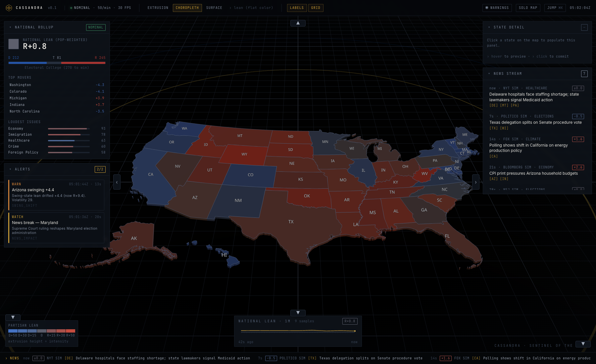
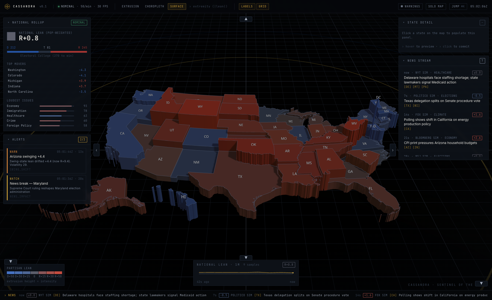
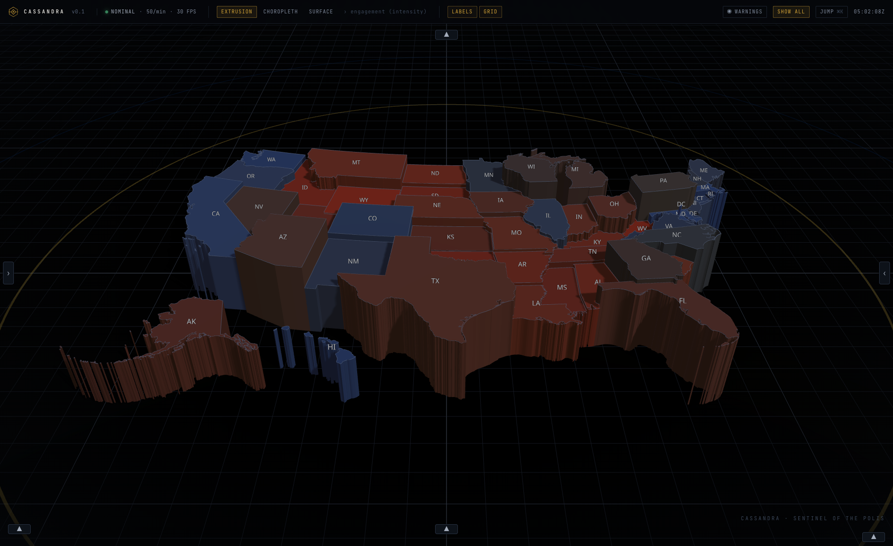
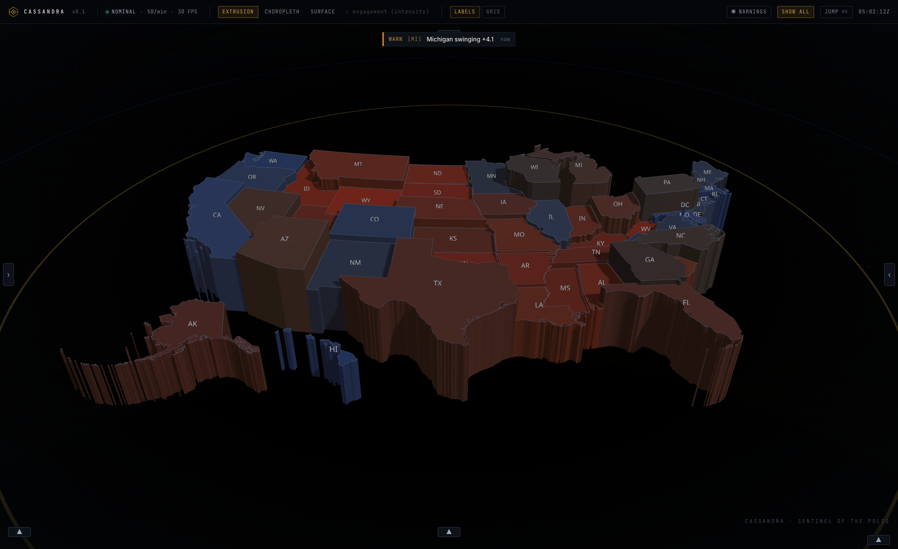
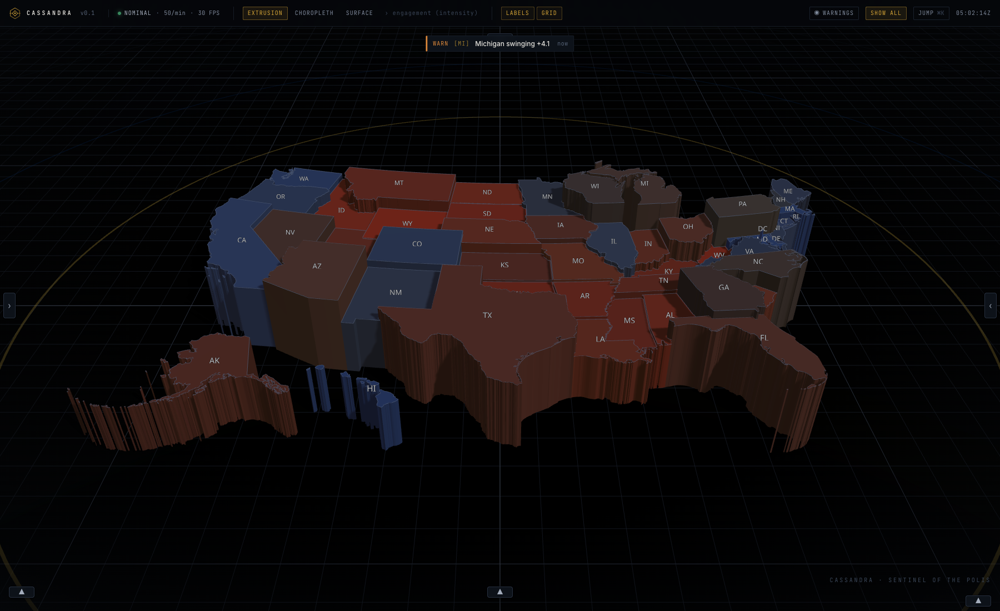
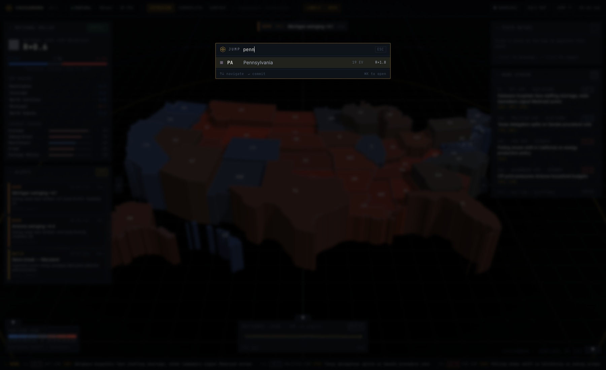

<div align="center">



# CASSANDRA

> *She sees what others refuse to see.*

**Real-time US political sentiment intelligence — rendered as a 3D geospatial console.**

[](#)
[](#)
[](https://nextjs.org/)
[](https://threejs.org/)
[](https://www.typescriptlang.org/)
[](LICENSE)

</div>

---

Cassandra fuses **poll movement**, **news sentiment**, and **public-discourse signals** into a single geospatial picture and surfaces meaningful shifts as they happen. High-signal, low-noise, dark-themed, information-dense. The aesthetic earns its pixels: every reticule, sigil, and glow encodes a real signal.

The whole pipeline runs as a single Next.js app: a deterministic simulation engine emits typed events over SSE, a Zustand store fans them out, and a `react-three-fiber` canvas updates 50 extruded state prisms imperatively at 60fps — without React re-rendering the scene.

---

## ▾ Gallery

### Full HUD



50 states + DC as extruded prisms, color = partisan lean × intensity, height = engagement intensity. Left rail: national rollup (lean, EC balance, top movers, loudest issues) + Alerts Center. Right rail: state detail (populated on selection) + live news stream. Bottom: national lean trajectory and rolling news ticker.

### Three layer modes — one map, three questions

<table>
  <tr>
    <td align="center" width="33%"><strong>EXTRUSION</strong><br/><sub>height = engagement</sub></td>
    <td align="center" width="33%"><strong>CHOROPLETH</strong><br/><sub>flat color only</sub></td>
    <td align="center" width="33%"><strong>SURFACE</strong><br/><sub>height = political extremity</sub></td>
  </tr>
  <tr>
    <td></td>
    <td></td>
    <td></td>
  </tr>
</table>

EXTRUSION answers *"where is the polity engaged?"* — height grows with intensity. CHOROPLETH answers *"how does the country lean?"* — flat color readout. SURFACE answers *"where is the polity polarized?"* — height grows with `|lean|`, so solid-red and solid-blue states rise tallest and swing states stay flat.

### Solo Map — operator's full-canvas view



One click on `SOLO MAP` in the top bar collapses every HUD panel and leaves the country to fill the canvas. Toast notifications still surface critical alerts at top-center — silence them with the `MUTED` button. Every collapse is one chevron-click away from being restored.

### Floor grid toggle — reference plane for distance

<table>
  <tr>
    <td align="center" width="50%"><strong>GRID OFF</strong></td>
    <td align="center" width="50%"><strong>GRID ON</strong></td>
  </tr>
  <tr>
    <td></td>
    <td></td>
  </tr>
</table>

The `GRID` button in the top bar toggles a two-layer reference grid (fine 1-unit cells + bold 10-unit quadrants) on the stage floor. Off = pure void; on = calibrated reference plane.

### Jump palette — instant state targeting



`⌘K` from anywhere opens the palette. Type a code (`PA`) or name fragment (`penn`); arrow keys to navigate, Enter to commit. Each row shows the live partisan lean and EV count. Selecting a row fires a 900ms easeInOutCubic camera fly-to and pierces the state with a gold beam.

---

## ▾ Quickstart

```bash
git clone https://github.com/EgorKhaklin/cassandra
cd cassandra
npm install
npm run dev         # http://localhost:3939
```

That's it. The simulation begins ticking the moment the SSE stream is first subscribed; first paint within seconds, full telemetry within ~10s as history accumulates.

Verify the build before opening a PR:

```bash
npm test            # 30 unit tests
npm run typecheck   # strict TS
npm run build       # production bundle
```

---

## ▾ Why it's interesting

| | |
|---|---|
| **Real-time geospatial** | SSE multiplexes sentiment ticks, news, alerts, national rollups, and heartbeats over one HTTP/2 stream. 50 ticks/min, ~2KB each. Auto-reconnect, typed envelopes. |
| **60fps with 50 ticking meshes** | The canvas does **not** re-render React on every tick. State extrusions read the store imperatively inside `useFrame` and lerp `mesh.scale.z` + `material.color` directly — no diffing, no GC. |
| **Honest data presentation** | Every modeled metric carries a `Confidence` tag (HIGH/MED/LOW), every news item carries a `source` (`Sim` suffix in simulation mode), and every alert names the `rule` that fired. Provenance is a first-class field in the type system. |
| **Three views, one map** | EXTRUSION / CHOROPLETH / SURFACE answer different questions — engagement, lean, extremity — with the same geometry. The active mode's meaning is captioned in the top bar. |
| **Collapsible HUD** | Every panel has a chevron toggle that pins to the screen edge. `SOLO MAP` collapses all panels in one click. `MUTED` silences warning toasts. Everything is reversible. |
| **Deterministic simulation** | The engine uses a seeded PRNG (`0xC1A55ED`) so the simulation reproduces frame-for-frame across reloads — useful for QA and demos. Live mode swaps the simulation adapter; the consumer contract is unchanged. |

---

## ▾ Architecture

```
                            ┌─────────────────┐
                            │ Simulation core │  (sentiment-engine.ts)
                            │  OU random walk │  mean-reverting to 2024 baselines
                            └────────┬────────┘
                                     │
        ┌────────────────────────────┼─────────────────────────────┐
        ▼                            ▼                             ▼
 ┌─────────────┐             ┌──────────────┐             ┌──────────────┐
 │  News       │             │  Alert       │             │  National    │
 │  ingester   │ →impulse→   │  engine      │             │  rollup      │
 │ (13 templ.) │             │ (3 rules +   │             │ (EC, lean,   │
 │             │             │  dedupe)     │             │  loudest)    │
 └──────┬──────┘             └──────┬───────┘             └──────┬───────┘
        │                           │                            │
        └─────────────┬─────────────┴──────────────┬─────────────┘
                      │                            │
                      ▼                            ▼
              ┌──────────────────────────────────────────┐
              │  SSE multiplex /api/stream               │
              │  { kind: tick | news | alert | national  │
              │       | heartbeat }                      │
              └─────────────────┬────────────────────────┘
                                │
                                ▼
              ┌──────────────────────────────────────────┐
              │  React app                                │
              │  - useSentimentStream subscribes          │
              │  - Zustand store fans out updates         │
              │  - r3f Canvas reads state imperatively    │
              │    inside useFrame — NO React rerenders   │
              └──────────────────────────────────────────┘
```

Full layered diagram in [`docs/ARCHITECTURE.md`](docs/ARCHITECTURE.md).
Design system in [`docs/UI_LANGUAGE.md`](docs/UI_LANGUAGE.md).
Methodology + honesty posture in [`docs/DATA_SOURCING.md`](docs/DATA_SOURCING.md).

---

## ▾ Tech stack

- **Next.js 14** (App Router) + **TypeScript 5.5** + **React 18** — single artifact, edge-streaming SSE built in
- **React Three Fiber 8.16** + **drei** + **three.js 0.166** — declarative scene graph with imperative escape hatches for the per-tick hot path
- **d3-geo + topojson-client + us-atlas** — Albers USA projection of state polygons (proper AK/HI insets); computed once and cached
- **Tailwind CSS 3.4** — utility-first, zero runtime
- **Zustand 4.5** — per-field selectors; canvas bypasses subscriptions via `useAppStore.getState()` inside `useFrame`
- **Vitest 1.6** — pure-logic unit tests on engine + alert rules + color scale + formatters

---

## ▾ Hot path

The whole pipeline is built so that one sentiment tick mutates the GPU buffers without React touching the DOM:

```ts
// src/components/map/StateExtrusion.tsx
useFrame(() => {
  const mesh = meshRef.current;
  const mat  = matRef.current;
  if (!mesh || !mat) return;

  // Imperative store read — no React subscription, no rerender.
  const s = useAppStore.getState().states[geom.code];
  if (!s) return;

  // Target prism height depends on layer mode.
  let targetH = EXTRUSION_BASE + s.intensity * EXTRUSION_GAIN;
  if (layer === 'choropleth') targetH = EXTRUSION_BASE;
  if (layer === 'surface')    targetH = EXTRUSION_BASE + Math.abs(s.partisanLean) * EXTRUSION_GAIN * 1.4;

  // Lerp directly on the THREE object — no React state.
  mesh.scale.z = lerp(mesh.scale.z, targetH, 0.14);
  tmpColor.set(leanColor(s.partisanLean, s.intensity));
  mat.color.lerp(tmpColor, 0.2);
});
```

The only React renders are HUD panels reacting to *coarse* events (selection change, national snapshot, new alert) — never the 50/min sentiment ticks.

---

## ▾ Project layout

```
cassandra/
├── docs/
│   ├── ARCHITECTURE.md             layered diagram, module boundaries
│   ├── UI_LANGUAGE.md              palette, type, motion, voice
│   ├── DATA_SOURCING.md            methodology + honesty posture
│   └── screenshots/                hero gallery
├── public/                         static assets
├── scripts/                        debug, screenshot, hero-shot helpers
├── src/
│   ├── app/
│   │   ├── layout.tsx · page.tsx · globals.css
│   │   └── api/
│   │       ├── stream/route.ts     SSE multiplexer
│   │       ├── snapshot/route.ts   one-shot bootstrap
│   │       └── history/route.ts    rolling national ring buffer
│   ├── components/
│   │   ├── layout/                 TopBar, SidePanels
│   │   ├── map/                    USAMap3D, StateExtrusion (hot path),
│   │   │                           CameraController, SelectionBeam, GridPlane,
│   │   │                           StateLabel, Lighting, FpsMonitor, MapLegend
│   │   ├── panels/                 StateDetail, NationalMetrics, AlertsCenter,
│   │   │                           NewsFeed, NewsTicker, Timeline
│   │   ├── ui/                     Sigil, Sparkline, Card, ConfidenceBadge,
│   │   │                           Toast, PanelToggle, SearchPalette
│   │   └── StreamProvider.tsx
│   ├── data/                       states.ts, issues.ts, news-seed.ts
│   ├── engine/                     sentiment-engine, news-ingester,
│   │                               alert-engine, simulation (singleton)
│   ├── hooks/                      useSentimentStream
│   ├── lib/                        types, color-scale, geo, format,
│   │                               easing, rng, constants
│   └── store/                      app-store.ts (Zustand)
└── tests/                          5 suites, 30 cases
```

---

## ▾ Roadmap

**Shipped (MVP):**
- 3D US map (50 states + DC), Albers projection, three layer modes
- Smooth orbit/pan/zoom + 900ms fly-to + gold selection beam
- State detail panel with sparkline, issue bars, linked news, provenance footer
- National rollup with EC balance, top movers, loudest issues
- Live SSE stream + threshold-based alert engine with dedupe
- Cmd-K search palette
- Collapsible HUD with per-panel chevron toggles + Solo Map + Mute Warnings
- 10-minute national-lean timeline backed by a server-side ring buffer
- Two-layer reference grid (fine + major) toggleable from the top bar

**Phase 2:**
- Time scrubber: replay last N minutes from the ring buffer
- Live adapters: 538/Silver Bulletin polls, GDELT news, Common Crawl
- Pin & compare two states side-by-side over time
- User-defined alert subscriptions (WebSocket earns its keep)
- Source-disagreement indicator on every datum
- Mobile-optimized layout with gesture controls

---

## ▾ Honesty posture

> The platform's value is reading the polity honestly. Decorative deception would defeat the whole point.

- Default mode is **simulation** and labeled as such everywhere.
- Live mode is wired behind adapter interfaces — never silently active.
- Every modeled metric carries a `Confidence` badge.
- News items in sim mode have `source: '... Sim'` so they are unambiguously synthetic.
- Cassandra will not present a forecast without an explicit uncertainty interval.

See [`docs/DATA_SOURCING.md`](docs/DATA_SOURCING.md) for the full methodology, source contract, and what we explicitly will not do.

---

## ▾ License

MIT — see [LICENSE](LICENSE).

Built by [VANTA / Egor Khaklin](https://github.com/EgorKhaklin) — *the Cassandra inheritance is taken seriously.*
